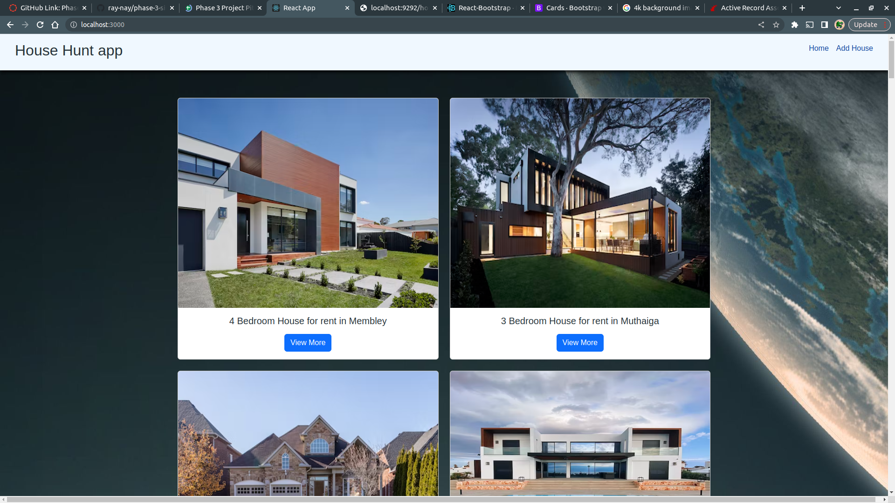
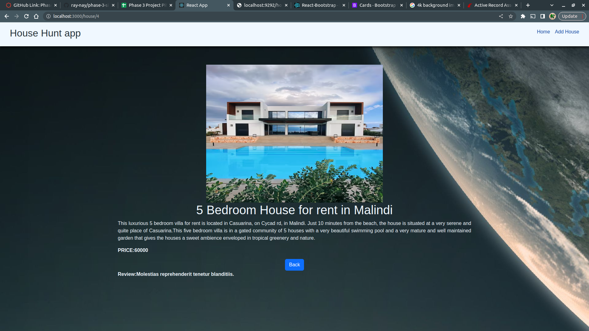
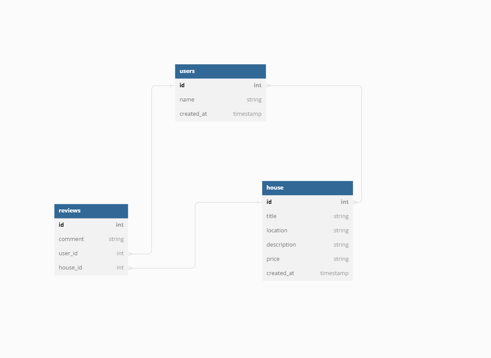

# Name of the Project
Dream House App
### Author : Name Date
Catherine Renee Mumbi

Joanne Muthoni

Khalif Nhashon

Teresa Maina

## Project Description
This project is a single page application that displays to the user a list of all the available houses that are up for rent on the website.

The user is required to signup on the website, once the user is signed in, they will be redirected to the landing page and here they will be able to view the houses. 

The user is able to view more details about the houses such as the description of the house as well as the price by clicking on the view more button. Once the user clicks on the view more button, they are able to see all the particular reviews associated with that house. 

The project incorporates a form that enables you to add a new house that is available for rent. 

Once the user, is done and wishes to logout, they can click on the logout button on the top right of the screen and this will re direct them back to the login page once more.

## Project SetUp
1. Clone the repository ( there are 2 repositories, one for the back end and one for the front end respectively)
(https://github.com/joanne-cmd/dream-house-backend) : This repository has all the starter code needed to get a Sinatra backend up and running.
(https://github.com/ray-nay/dreamhouse-frontend)

2. Install dependencies
    bundle install
    npm install

3. Run the migrations and seed the data through the following command 

    rails db:migrate db:seed

4. Start the development server
    rails server - This will run your server on port http://localhost:3000.
    npm start - This will run your server on port http://localhost:3001.

5. Open your browser and navigate to http://localhost:3000 to view the app.
    Enter your credentials on the sign up form

    To view the houses click on the Home button on the navbar to view all the available houses for rent.
    To view more details about a particular house, click on the View More button which will show you the description of the house as well as the price. To exit this page, click on the Back button which will take you back to the home page.
    To add a new house, click on the Add House button on the navbar and insert all the necessary details required on the form then press submit. It will alert you that the house has been added successfully. Navigate to the end of the list to see your added house.

    To logout click on the logout button. 
******
## Technologies Used
1.ReactJS
2.React Router
3.Babel
4.ESlint
5.Node.js
6.Ruby
7.Sweet alert
8.Postman
9.Dbdiagram.io
10.Sinatra
11.Rails
*****

### Signup page

This is the signup page.

### Landing page

This is the landing page.

### Form page

This is page that holds the form to be used when a user wants to add a new house.

### Submission page that is used to submit a new house.

This is the page that shows the success alert after a house has been added successfully.

### House display page

This is the page that displays the house description, as well as the price after the user has clicked on the View More button.

### Review page

This is the page that renders the particular reviews associated with the specific house.

### ERD

*****
